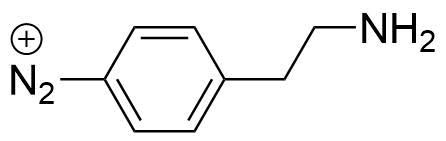
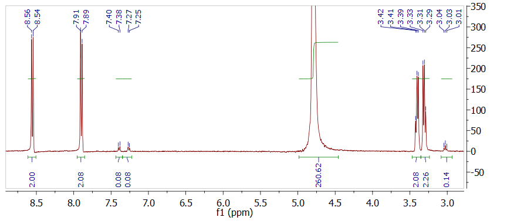
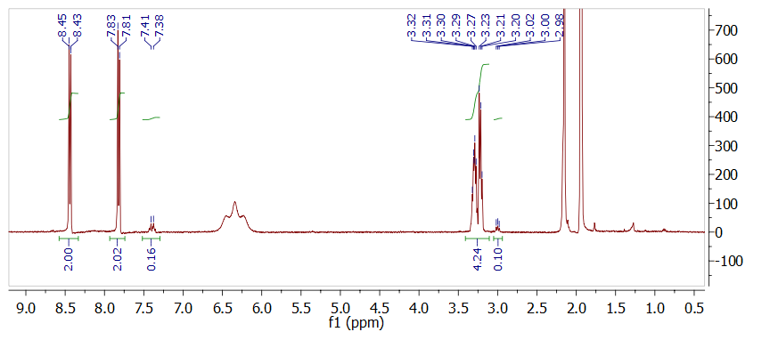

  
```{r, child="_setup.Rmd"}
```


I have realised, that it is necessary to perfom the synthesis of 4-(2-aminoethyl)benzenediazonium salt to be able to properly control the concentration during exfoliation.

```{r out.width='15%', echo = FALSE}

```


The group (and the literature in general) have many reported strategies for synthesising this compound, however the succes in the group has been varied. Several methods were found in old labbooks and in literature, and a summarised briefly [here](misc/AEBD_procedure/AEBD_procedure.html).

# Protocol: Synthesis of 4-aminoethylbenzenediazonium salt (AEBD)

The synthesis will be conducted according to the procedure from reference.[@Kowalczyk2011] To test the reaction, it will initially be conducted on 100 mg scale. 

```{r}
library(tidyverse)
library(units)
M_aniline = set_units(136.19, mg/mmol)
M_nitrite = set_units(69.00, mg/mmol)
M_diazo = set_units(234.99, mg/mmol) # With BF4-ion
rho_aniline = set_units(1034, mg/mL)

m_aniline = set_units(100, mg)
n_aniline = m_aniline / M_aniline
n_nitrite = n_aniline * 1.5
m_nitrite = n_nitrite * M_nitrite

m_diazo = M_diazo * n_aniline
```

Chemicals: 4-(2-Aminoethyl)aniline ([Sigma](http://www.sigmaaldrich.com/catalog/product/aldrich/123056?lang=en&region=DK), 97 %, `r format(M_aniline)`), Sodium nitrite (Manufacturer? `r format(M_nitrite)`), HBF~4~ (Sigma, 48 % in water), diethyl ether (Sigma, >99.8%)

1. 0.75 mL HBF~4~ is added to 1.25 mL water and the mixture allowed to cool to 0 $^{\circ}$C.
2. Then 4-(2-aminoethyl)aniline (`r format(m_aniline, digits = 2)`, `r format(m_aniline / rho_aniline, digits = 2)`, `r format(n_aniline, digits = 2)`) is dissolved in the HBF4 solution and allowed to cool to 0 $^{\circ}$C.
3. Sodium nitrite (`r format(m_nitrite, digits = 2)`, `r format(n_nitrite, digits = 2)`) is dissolved in 0.6 mL water and added drop by drop to the acidic amine while stirring.
4. The compounds are reacted for 40 min while keeping the mixture at 0 $^{\circ}$C.
5. A precipitate will appear in the solution and is suction filtrated and rinsed with freezer-cold diethyl ether. The salt is then dried under vacuum (without heating) and stored at -20 $^{\circ}$C.

The product can be characterised by ^1^H NMR in deuterated water.

The expected amount of 4-aminoethylbenzenediazonium tetrafluoroborate is `r format(m_diazo, digits = 2)`

# Journal

The synthesis was conducted on 20171025. After addition of 4-(2-aminoethyl)aniline (a yellow oil) to HBF~4~ the solution was light yellow. Upon addition of sodium nitrite the solution initially turned orange, and then as the reaction proceeded became milky white, as the precipitate formed.

After washing with 75 mL cold Et~2~O a white-orange powder was collected and dried on the vacuum line. 

The empty flask used for drying weighed `r (m_1 = units::set_units(13.1772, g))` g. The weight was `r (m_2 = units::set_units(13.3899, g))` g after drying. A total of `r format(m_2 - m_1)` was formed, corresponding to a yield of `r round((m_2 - m_1)/m_diazo * 100, digits = 1)` % (a small amount of product was lost while taking the sample of the vacuum line). This could indicate that the product is not completely pure or dry.

# Results and discussion
^1^H-NMR was obtained of the product. It exhibits peaks which are in agreement with literature values, as well as a small quantity of the starting material (roughly `r round((0.08)/(0.08+2.08)*100, digits = 1)` %) and a rather large amount of water. The water probably comes from both redisual water in the product and water present in the D~2~O used for NMR.




However, repeating NMR in CD~3~CN shows that almost no water is present, so the water observed in the first NMR must be from D~2~O. A new impurity is observed at ca. 6.3 ppm, which was not observed previously. I do not expect that this is from my product.



# Conclusion and outlook
The synthesis of 4-aminoethylbenzenediazonium salt was easy and a high-purity product in decent yield was obtained. This procedure should be easy to scale up, in order to synthesise several grams for graphene functionalisation.

# References
