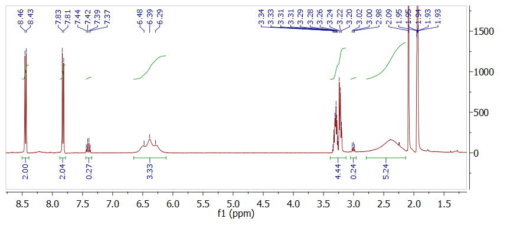
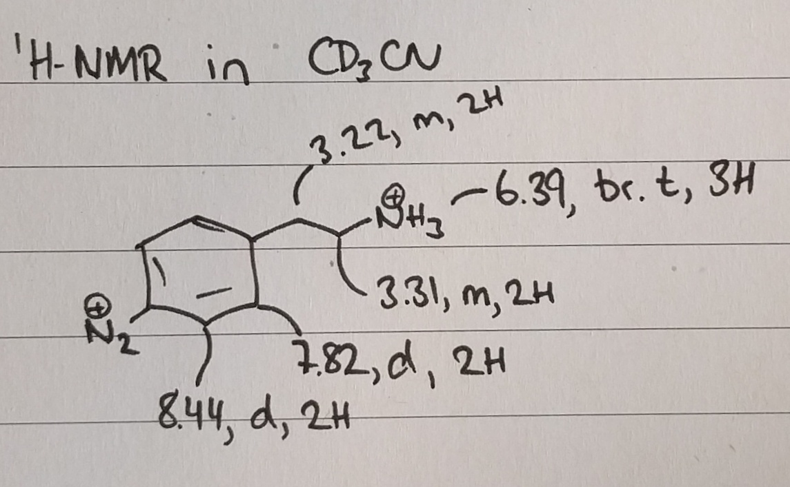

```{r, child="_setup.Rmd"}
```

Previously, [a small batch of AEBD was synthesised](20171023_Synthesis_of_4-2-aminoethylbenzenediazonium_salt.html), but for future experiments a larger quantity is needed. For this reason, this experiment will try to scale the synthesis from 0.1 g scale to 2.0 g.


# Protocol: Synthesis of 4-aminoethylbenzenediazonium salt (AEBD)

The synthesis will be conducted according to the procedure from reference.[@Kowalczyk2011] To test the reaction, it will initially be conducted on 100 mg scale. 

```{r}
library(tidyverse)
library(units)

sc <- 20 # Scaling factor for this experiment
dig <- 3

M_aniline = set_units(136.19, mg/mmol)
M_nitrite = set_units(69.00, mg/mmol)
M_diazo = set_units(234.99, mg/mmol) # With BF4-ion
rho_aniline = set_units(1034, mg/mL)

m_aniline = set_units(100 * sc, mg)
n_aniline = m_aniline / M_aniline
n_nitrite = n_aniline * 1.5
m_nitrite = n_nitrite * M_nitrite

m_diazo = M_diazo * n_aniline

V_HBF4 = set_units(0.75 * sc, mL)  # 48 % HBF4 solution
V_H2O_first = set_units(1.25 * sc, mL) 
V_H2O_second = set_units(0.6 * sc, mL) 
```

Chemicals: 4-(2-Aminoethyl)aniline ([Sigma](http://www.sigmaaldrich.com/catalog/product/aldrich/123056?lang=en&region=DK), 97 %, `r format(M_aniline)`), Sodium nitrite (Manufacturer? `r format(M_nitrite)`), HBF~4~ (Sigma, 48 % in water), diethyl ether (Sigma, >99.8%)

1. `r format(V_HBF4, digits = dig)` HBF~4~ is added to `r format(V_H2O_first, digits = dig)` water and the mixture allowed to cool to 0 $^{\circ}$C.
2. Then 4-(2-aminoethyl)aniline (`r format(m_aniline, digits = dig)`, `r format(m_aniline / rho_aniline, digits = 3)`, `r format(n_aniline, digits = dig)`) is dissolved in the HBF4 solution and allowed to cool to 0 $^{\circ}$C.
3. Sodium nitrite (`r format(m_nitrite, digits = dig)`, `r format(n_nitrite, digits = dig)`) is dissolved in `r format(V_H2O_second, digits = dig)` water and added drop by drop to the acidic amine while stirring.
4. The compounds are reacted for 40 min while keeping the mixture at 0 $^{\circ}$C.
5. A precipitate will appear in the solution and is suction filtrated and rinsed with freezer-cold diethyl ether. The salt is then dried under vacuum (without heating) and stored at -20 $^{\circ}$C.

The expected amount of 4-aminoethylbenzenediazonium tetrafluoroborate is `r format(m_diazo, digits = dig)`

# Journal

The synthesis was conducted in a scaled up version of the previous 100 mg synthesis. Upon addition of the 4-(2-aminoethyl)aniline to the HBF~4~ solution a precipitate was starting to form. 5 mL H~2~O and 9 mL HBF~4~ was added, which helped a little, but did not completely dissolve everything. 

The solution turned red/orange upon addition of sodium nitrite.

After drying `r (m_prod <- 48.5031 - 43.1822)` g product was obtained. This corresponds to a yield of `r signif(m_prod / (322.8 * 0.0147) * 100)` %, which is clearly too high.

# Results and discussion

## NMR spectroscopy
^1^H-NMR was obtained in CD~3~CN.

```{r echo=FALSE, out.width='90%'}

```

The major peaks can be assigned as follows, which is in good agreement with the expected product. Not that the amine peak at 6.4 ppm corresponds roughly to 3H, indicating that the amine is protonated. It was [previously determined](20171023_Synthesis_of_4-2-aminoethylbenzenediazonium_salt.html) that this peak disappears in D~2~O, confirming that it is the amine. 

```{r echo=FALSE, out.width='33%'}

```

## ATR-IR

```{r}
library(tidyverse)
ir171128 <- read_delim("data/raw_data/ir/2017118_ATR-IR_AEBD/20171128_AEBD.csv", delim = ";", locale = locale(decimal_mark = ","), skip = 2, col_names = c("wavenumber", "transmission"))

ir171128peaks <- ir171128 %>%
  peakr::add_pick(c(3501,3479,3460,3314,3269,3233,3218,3180,3152,3074,3065,2993,2804,2733,2709,2682,2600,2572,2528,2503,2411,2381,1716,891,795,731)) %>% 
  filter(peak) %>% 
  #mutate(n = sample(x = c(4, 8, 12, 16), size = n(), replace = TRUE))
  mutate(n = rep(x = c(1,4,2,6,3,5)*2.5 + 1, length = n()))

ir171128 %>% 
  ggplot(aes(wavenumber, transmission)) +
  geom_line() +
  scale_x_reverse() +
  #geom_point(data = . %>% filter(peak), color = "red") +
  #ggrepel::geom_text_repel(data = . %>% filter(peak), aes(wavenumber, transmission, label = wavenumber), size = 2, color = "red", min.segment.length = 0.1, direction = "y")
  geom_text(data = ir171128peaks, aes(wavenumber, transmission - n, label = wavenumber), color = "red", size = 2.5) +
  geom_segment(data = ir171128peaks, aes(x = wavenumber, xend = wavenumber, y = transmission - 1, yend = transmission - n + 1.5), color = "red", alpha = 0.75)

```

The IR spectrum obtained from the sample is also in good agreement with the expected product. The amine is evident from the peaks at 3270 and 3206 cm^-1^ and the N≡N stretch in the diazonium compound is seen at 2285 cm^-1^. A very strong band is seen at 1008 cm^-1^ from $BF_4^-$-ions acting as counterions to both the diazonium group and the protonated amine. 

# Conclusion and outlook
The synthesis of 4-aminoethylbenzenediazonium salt was succesful, however an unidentified impurity is present in the ^1^H-NMR spectrum, which probably accounts for the large mass obtained. Based on NMR it also seems that the conversion of the starting materials is near quantitative.

The product is protonated. The structure is really 4-(2-ammonioethyl)benzenediazonium. The total molar mass is 322.8 gm/mol, while the diazonium compound itself weighs 149.2 gm/mol (expected exact mass in ESI-MS is 149.0942 gm/mol, which equals an m/z of 74.5471)

```{r echo = FALSE}
knitr::include_graphics('figs/AEBD_2.png')
```


