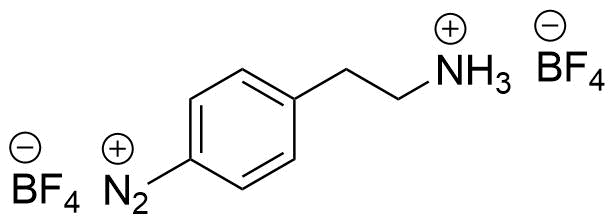

```{r, child="_setup.Rmd"}
```

I ran out of AEBD so I have to synthesize a new batch. The protocol from [20171106](20171106_Raman_spectroscopy_of_AEBD.html) will be followed (2.0 g scale).

```{r echo = FALSE, out.width='20%'}

```


# Protocol: Synthesis of 4-aminoethylbenzenediazonium salt (AEBD)

The synthesis will be conducted according to the procedure from reference.[@Kowalczyk2011] 

```{r}
library(tidyverse)
library(units)

sc <- 20 # Scaling factor for this experiment
dig <- 3

M_aniline = set_units(136.19, mg/mmol)
M_nitrite = set_units(69.00, mg/mmol)
M_diazo = set_units(322.80, mg/mmol) # With BF4-ion
rho_aniline = set_units(1034, mg/mL)

m_aniline = set_units(100 * sc, mg)
n_aniline = m_aniline / M_aniline
n_nitrite = n_aniline * 1.5
m_nitrite = n_nitrite * M_nitrite

m_diazo = M_diazo * n_aniline

V_HBF4 = set_units(0.75 * sc, mL)  # 48 % HBF4 solution
V_H2O_first = set_units(1.25 * sc, mL) 
V_H2O_second = set_units(0.6 * sc, mL) 
```

Chemicals: 4-(2-Aminoethyl)aniline ([Sigma](http://www.sigmaaldrich.com/catalog/product/aldrich/123056?lang=en&region=DK), 97 %, `r format(M_aniline)`), Sodium nitrite (Manufacturer? `r format(M_nitrite)`), HBF~4~ (Sigma, 48 % in water), diethyl ether (Sigma, >99.8%)

1. `r format(V_HBF4, digits = dig)` HBF~4~ is added to `r format(V_H2O_first, digits = dig)` water and the mixture allowed to cool to 0 $^{\circ}$C.
2. Then 4-(2-aminoethyl)aniline (`r format(m_aniline, digits = dig)`, `r format(m_aniline / rho_aniline, digits = 3)`, `r format(n_aniline, digits = dig)`) is dissolved in the HBF4 solution and allowed to cool to 0 $^{\circ}$C.
3. Sodium nitrite (`r format(m_nitrite, digits = dig)`, `r format(n_nitrite, digits = dig)`) is dissolved in `r format(V_H2O_second, digits = dig)` water and added drop by drop to the acidic amine while stirring.
4. The compounds are reacted for 40 min while keeping the mixture at 0 $^{\circ}$C.
5. A precipitate will appear in the solution and is suction filtrated and rinsed with freezer-cold diethyl ether. The salt is then dried under vacuum (without heating) and stored at -20 $^{\circ}$C.

The expected amount of 4-aminoethylbenzenediazonium tetrafluoroborate is `r format(m_diazo, digits = dig)`

# Journal

The synthesis was conducted in as described. Both the aniline and sodium nitrite was added drop by drop to limit early precipitation. The solution turned red/orange upon addition of sodium nitrite, and a white/pink precipitate quickly formed. 

After drying `r (m_prod <- 47.7137 - 43.1599)` g product was obtained. This corresponds to a yield of `r round(m_prod / (322.8 * 0.0147) * 100, digits = 2)` %.

# Results and discussion

## ^1^H-NMR

A sample for ^1^H-NMR was made in CD~3~CN. It looks as expected and shows a similar small residue of starting materials as the previous synthesis.

```{r echo = FALSE}

```


# Conclusion and outlook
