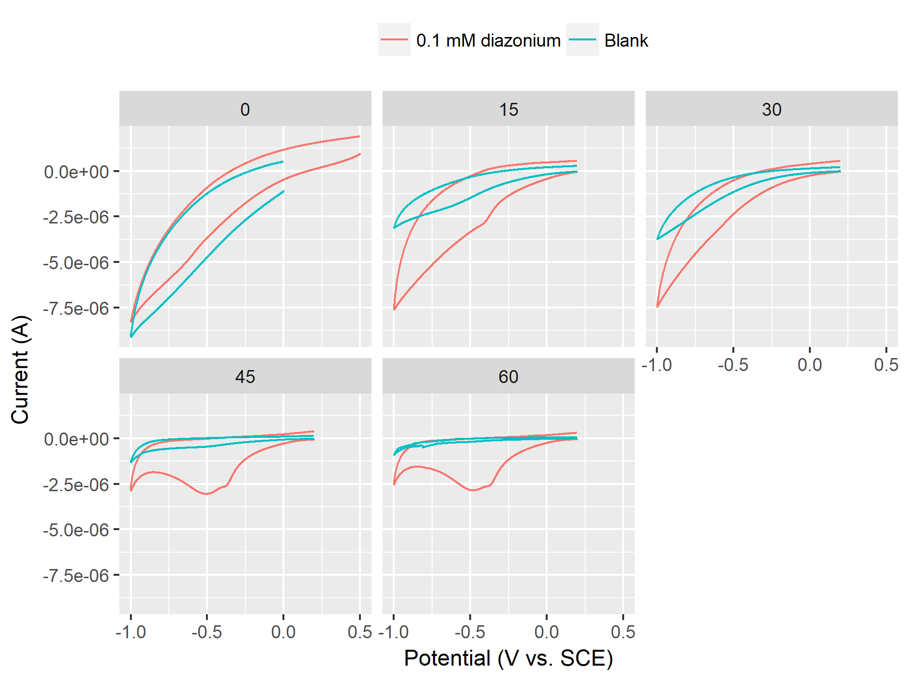

```{r setup, include=FALSE}
knitr::opts_chunk$set(echo = TRUE)
```

```{r child = 'biweekly_header.Rmd'}
```

# Planned experiments from last biweekly report

* Continue working with large scale production and start a big production of Gr-NH~2~ for Radisurf (in progress)
* Discuss possibilites of publishing Andreas' work with the chemical engineers (in progress)
* Redo high-voltage bipolar electrochemical functionalisation (not started)

# Gr-NH~2~ production for Radisurf
Radisurf wants to have a few grams of amine-functionalised graphene to do ATRP-polymerisation and later incorporation in silicone. I have started fabrication of this.

## Experimental setup
An 8x15 cm^2^ graphite electrode was exfoliated in 0.1 sulphuric acid containing 2 mM 4-(2-aminoethyl)benzenediazonium compound (generated _in situ_). 10 V was applied between the graphite anode and stainless steel cathodes for 90 min.

0.5 mL samples were extracted every 15 min and diluted in 9.5 mL 0.1 M H~2~SO~4~. CVs were obtained from these solutions in an attempt to follow the diazonium concentration. The reason this is interesting to study, is that the solution heats up to ca. 70 degrees during exfoliation, which could potentially degrade the diazonium compound in solution. 

## Results
By weighing the graphite electrode before and after it was found that __5.2 g graphite was exfoliated in 90 min__. This is currently being further processed, so that Radisurf can get it as a dry powder in the end. 

The CVs of the solution at different times is shown below.
```{r echo=FALSE, out.width='80%'}

```

It is not immediately clear that this is a good technique to follow the diazonium concentration. I made a quick test by dissolving a bit of ferrocene in DMF and adding some of the diazonium-solution. This gave a green color both before and after the exfoliation, indicating that the diazonium-compound survived the high temperature.

## Conclusion
A large quantity of graphene was exfoliated in a quick and easy way. The processing of these large quantities is more difficult, but can be done. I expect to have graphene ready for Radisurf (and general characterisation early next week). 

# Plan for the next two weeks
* Make and discuss a more detailed plan for collaboration with the chemical engineers.
* Finalise production of graphene for Radisurf and characterise the product.
* Produce graphene for SP Group.