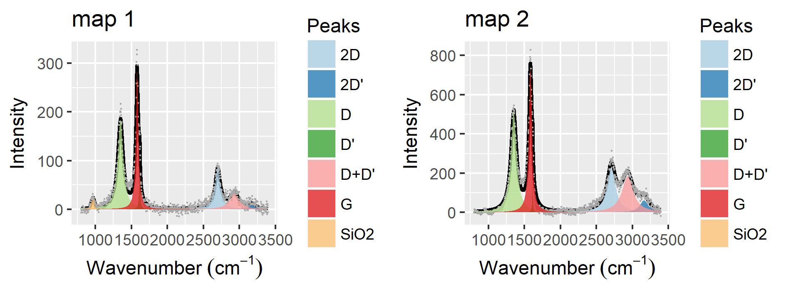
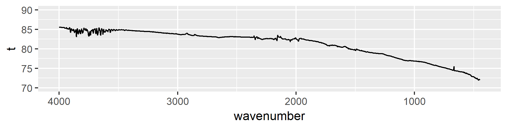
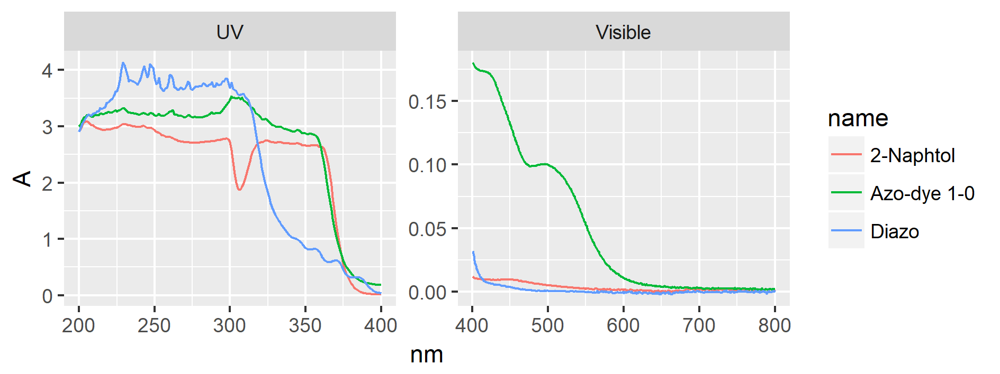
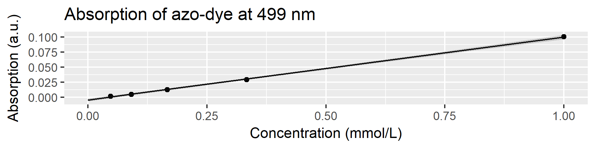

```{r setup, include=FALSE}
knitr::opts_chunk$set(echo = TRUE)
```

```{r child = 'biweekly_header.Rmd'}
```

# Planned experiments from last biweekly report

* Make and discuss a more detailed plan for collaboration with the chemical engineers (not done)
* Finalise production of graphene for Radisurf and characterise the product (Done, but concerns on the final quality)
* Produce graphene for SP Group (Not done)
* Test azo-dye formation from diazonium salt and 2-Naphtol.

# Gr-NH~2~ production for Radisurf
Radisurf wants to have a few grams of amine-functionalised graphene to do ATRP-polymerisation and later incorporation in silicone. I finished the fabrication of this.

## Characterisation
The production gave a lot of graphene (ca. 3.5 gram). However, it was in the end obtained as a mix of thin sheets and harder chunks after freeze-drying. The problem is probably that the Gr-NH~2~ / H~2~O solution thawed before the freeze-drying was finished, making the graphene collapse. I asked Andreas about this, and it seems that he got a much finer powder from freeze-drying smaller quantities at a time, so I will try this in the next experiment. 

### Raman spectroscopy
Raman spectroscopy was performed on the freeze-dried graphene. As expected we have well-defined features, and a large D-peak from the defects induced by the oxidative exfoliation. 

```{r echo=FALSE}

```

### XPS
XPS was also measured and the results are in the table below.
```{r xpsres170920, warning=FALSE, message=FALSE, echo=FALSE}
library(tidyverse)
xpsres170920 <- read_tsv('../data/derived_data/xps/20170920_Gr-NH2_for_Radisurf/20170920_xps_ratios.txt', skip = 2)

xpsres170920 %>%
  select(ends_with("%")) %>% 
  rename_all(
      funs(
        stringr::str_extract(., "^[a-zA-Z0-9\\s]*")
      )
  ) %>% 
  gather(key = 'element', value = 'value') %>% 
  group_by(element) %>% 
  summarise(m = mean(value), sd = sd(value)) %>% 
  mutate_at(c('m', 'sd'), round, digits = 2) %>% 
  knitr::kable(col.names = c('Element', 'Mean', 'Std. dev.'))
```

Nitrogen was clearly introduced in the graphene, as would be expected for amine-functionalised graphene. Some of the N might also be from azo-coupled diazonium salt. HR-XPS of the N 1s peak might be able to give more information.

In this data a sulphur-peak was also clearly observed at approx. 168.5 eV. A thiol whould normally be observed at 164 eV, so this suggests that we have -SO~4~ bound to the surface, as would probably be expected from the oxidative exfoliation in sulphuric acid. Andreas did not observed this in his experiments. It might be possible to anneal the graphene and get rid of this.

### ATR-IR
Seeing that XPS revealed nitrogen I was tempted to do ATR-IR on some of the powder.

```{r  echo=FALSE}

```

However, it seems that concentration is too low to observed any amine-groups. Maybe it could be possible to deposit the graphene on a reflective surface such as gold and do PM-IRRAS.

## Conclusion
Based on XPS-measurements it seems that the amine-functionalisation was succesful. The electrochemical approach was not useful for following the diazonium-concentration.

The freeze-drying procedure was only partly succesfull, since a product that was too compact was obtained. Freeze-drying small amounts (perhaps 100 mL) is probably the way to go.

# Following the diazonium-concentration with UV-Vis spectroscopy
When the diazonium-functionalised graphene is produced the solution heats up due to the large current used (ca. 20 A). For this reason one could be worried about the stability of the diazonium-compound, so it would be nice to be able to monitor this concentration as the experiment runs. This way we will know whether the production runs as-is, of if we have to add additional diazonium salt during the course of the exfoliation.

Steen suggested using the following reaction to form an azo-dye.

```{r echo = FALSE}
knitr::include_graphics('../figs/azo-coupling.png')
```

I tested the reaction by forming a 2 mM solution of the diazonium compound *in-situ*. 2 mL of the diazonium-solution is then added to 2 mL of the basic 2-Naphtol solution. This should form an orange-red dye upon heating. The final concentration of the dye is 1 mmol/L.

```{r echo = FALSE}

```

```{r echo = FALSE}

```

The absorption coefficient at 499 nm becomes 0.104 ± 0.005 mM^-1^ cm^-1^. This method should be an easy approach for monitoring the diazonium-concentration in the next graphene production. I intend to periodically extract 2 mL samples from the exfolation solution and inject into vials with 2 mL of the basic 2-Naphtol solution. The dye appears to be stable, so these can then be analysed after the production is completed.
 
# Plan for the next two weeks
* Make and discuss a more detailed plan for collaboration with the chemical engineers.
* Produce new graphene for Radisurf and SP Group with monitoring of diazonium-concentration and hopefully a better freeze-drying.