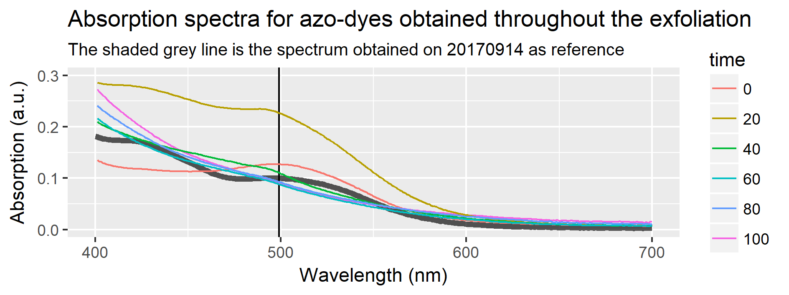
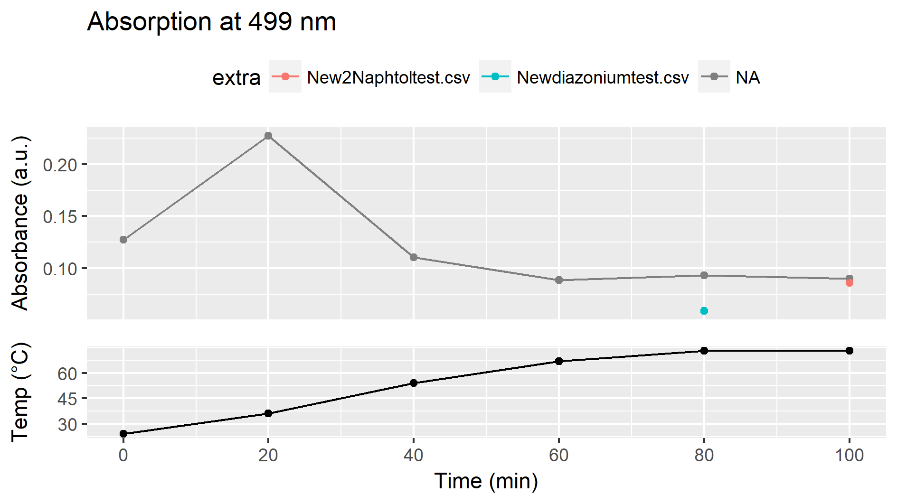
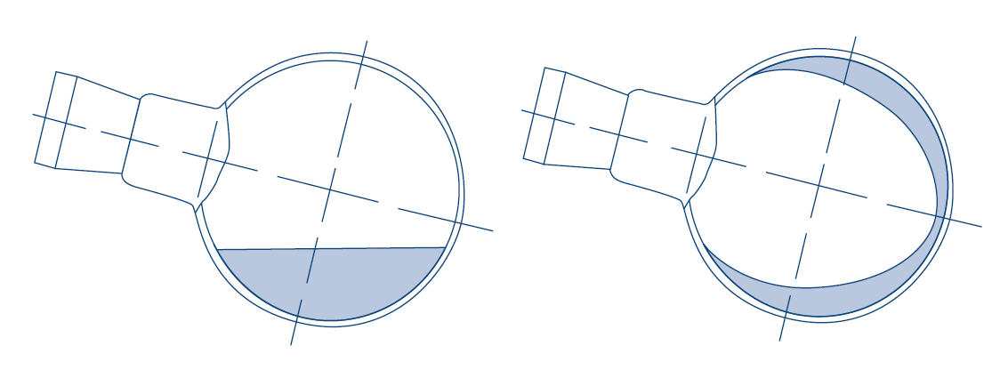

```{r setup, include=FALSE}
knitr::opts_chunk$set(echo = TRUE)
```

```{r child = 'biweekly_header.Rmd'}
```

# Planned experiments from last biweekly report

* Make and discuss a more detailed plan for collaboration with the chemical engineers.
* Produce new graphene for Radisurf and SP Group with monitoring of diazonium-concentration and hopefully a better freeze-drying.

# Monitoring diazonium-concentration with UV-Vis
I have made a new graphene production, with the intention of sending it to SP-Group. We previously discussed how the diazonium-concentration develops during the experiment and that it should be possible to monitor the concentration by reacting the diazonium-compound with a solution containing 2-Naphtol to form an azo-dye. 

For this graphene production, samples of the 0.1 M H~2~SO~4~ with diazonium salt were extracted every 20 min and injected into a basic solution of 2-Naphtol. The samples were heated to 40 $^{\circ}$C for 2 min and an absorption spectrum recorded. The figure below displays the spectra, along with a reference spectrum of the azo-dye obtained previously. 



The figure below shows the temperature vs. time of the production, and the absorption at 499 nm at different times. 



Indications of a peak at 499 nm is seen up until 40 min. At this point the temperature goes above 50 degrees, and the diazonium compound probably decomposes.  The increase in intensity (and thus concentration) at 20 min. could indicate that the diazonium-compound did not form completely before being heated a little bit. 

It is puzzling that the spectra obtained appear different than the reference spectra in the Figure above.


# Freeze-drying the graphene
The major obstacle during the last two weeks, have been isolating the finished product using freeze-drying. Andreas freeze-dried some graphene during his project without problems, but I have been working with a previous graphene production, and even after freezing the samples for long periods of time in liquid nitrogen, they keep thawing, making it impossible to isolate a nice fluffy powder.

I have tried spin-freezing (see below), to increase the surface area and speed up the sublimation, and it seems to help but does not solve it.


 
I have also tried to insulate the frozen flask with paper and alu-foil, which does help to some degree.

It still appears to me, that the freeze-drying acts significantly different than when Andreas did it. My main hypothesis for this right now is that residual acid and salts in the water suspending the graphite might have a significant influence on the freezing-point, affecting the whole process. Since Andreas was working on smaller scale, this was not a problem, but my batches are approx. 50 times bigger, so more extensive washing is needed to remove salt and acid.

The current batch I am making (in production on Friday, not done yet) was washed extensively and I measured the pH of the final filtrate to be ca. 6, which should be much cleaner than what I previously tried to freeze-dry. I hope this solves the issues with the process. 

Good access to a freeze-drier is also a bit of a problem. Since I am producing rather large batches right now and need to produce a lot, it becomes difficult to freeze-dry it all, without occupying e.g. Thomas Poulsens freeze-drier too much. There is another freeze-drier at iNANO that I might also be able to use, but it would be really nice to have dedicated equipment for the freeze-drying. 
 
# Plan for the next two weeks
* Make and discuss a more detailed plan for collaboration with the chemical engineers.
* Produce new graphene for Radisurf and SP Group
* Graphene meeting at Newtec on October 31st