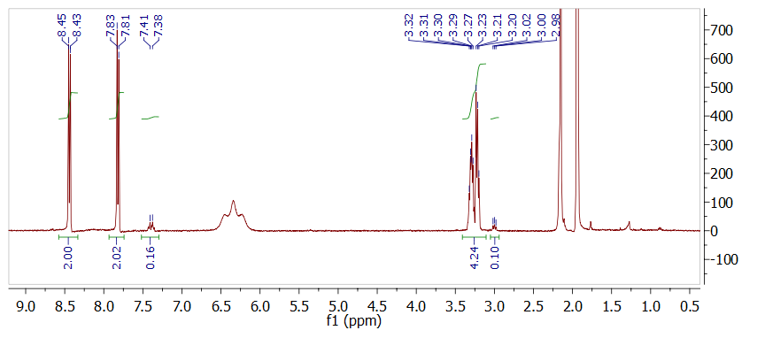
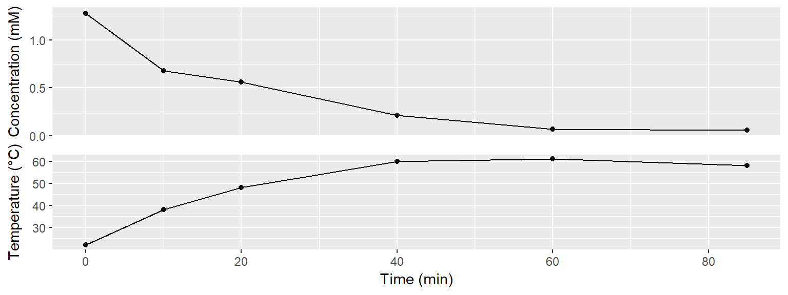
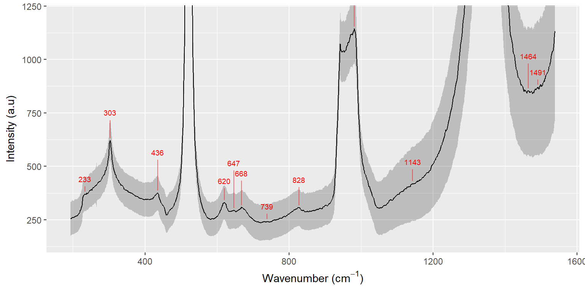

```{r setup, include=FALSE}
knitr::opts_chunk$set(echo = TRUE)
```

```{r child = 'biweekly_header.Rmd'}
```

# Planned experiments from last biweekly report


* Make and discuss a more detailed plan for collaboration with the chemical engineers.
* Produce new graphene for Radisurf and SP Group
* Graphene meeting at Newtec on October 31st

# Synthesis of diazonium salt

Based on last weeks biweekly discussion, I found [a protocol](../20171023_Synthesis_of_4-2-aminoethylbenzenediazonium_salt.html) for synthesising 4-aminoethylbenzenediazonium tetrafluoroborate (AEBD). I tested it last week, and it appears that I can synthesise the compound in high yield and purity. The NMR (below) shows the expected peaks with only a small amount of starting material. The strange peak at 6.3 ppm is of unknown origin, but it was not present in an NMR obtained in D~2~O. 

```{r out.width='19%', echo = FALSE}
knitr::include_graphics("../figs/AEBD.png")
```
```{r out.width='95%', echo = FALSE}

```

I have recieved 10 g of starting material for the synthesis, so I have plenty for the time coming. 


# Monitoring diazonium-concentration with UV-Vis

## Experimental setup

A new graphene production was made in 0.1 M H~2~SO~4~ with 2 mM AEBD using a 2x6 cm^2^ graphite foil by applying 10 V between graphite and stainless steel. 1 mL samples of exfoliation solution was extracted regularly and injected into 3 mL 1 mM 2-Naphtol in basic solution to form an azodye. The graphene was afterwards purified and freeze-dryed. In this experiment 86 mg graphene was obtained (21 % yield), but this should easily be higher on a larger scale. 

## Results and Discussion

### UV-Vis and general proceeding of the reaction

Using the new diazonium compound, it is straightforward to follow the concentration of diazonium salt by measuring the absorption of the azo-dye. 

```{r message = FALSE, echo = FALSE, fig.height=2.5}
library(tidyverse)
spectra <- tibble(files = list.files("../data/raw_data/uvvis/20171027_GrNH2_azodye/", full.names = TRUE)) %>% 
  mutate(data = map(files, read_delim, delim = ";", skip = 1)) %>% 
  mutate(time = stringr::str_extract(files, "\\d{2}(?=min)") %>% as.factor()) %>% 
  unnest() 

spectra %>% 
  ggplot(aes(nm, A, color = time)) + 
  geom_vline(xintercept = 499) +
  geom_line() +
  scale_color_brewer(palette = "Set1") +
  labs(x = "Wavelength (nm)", y = "Absorption", color = "Time (min)")
```

The concentration of diazonium salt clearly drops quite rapidly, and no significant amounts are left at 60 mins and beyond. 

```{r echo = FALSE, out.width="95%"}

```


### Raman spectroscopy

Samples of the graphene was deposited on SiO~2~ and analysed with Raman spectroscopy. The spectra in two maps has been summarised by their mean (black line) ± 1 standard deviation (grey ribbon), which are plotted below. An automated peak finding algorithm was used to mark the peaks in the spectra (clearly it didn't do a perfect job).

A spectrum with the 2400 l/mm grating gives a closer look on the 2500-3500 cm^-1^ region. There is  a weak unusual feature at 3246 cm^-1^, which might be ascribed to N-H stretching in the amine. This would have to be tested against a control sample without the amine to be sure.

```{r echo=FALSE, out.width="95%"}
knitr::include_graphics("../20171027_GrNH2_production_with_new_diazonium_salt_files/figure-html/unnamed-chunk-5-1.png")
```

When looking at the lower range of the spectrum, 200-1500 cm^-1^, a range of peaks are observed, which is not usually seen for ordinary graphene. First of all, the large peak at 1350 cm^-1^ is the D-peak of graphene, while the peaks at 520 and 1000 cm^-1^ are related to the Si/SiO~2~ substrate.

If we have attached groups of Graphene-phenyl-CH~2~CH~2~NH~2~ (or perhaps -NH~3~^+^) we could expect to see C-N stretch between 1240-1020 cm^-1^, and it appears that there is a small shoulder on the D-peak at approx. 1140 cm^-1^. It could also be from (CH~2~)~n~ twisting vibrations, which should be strong in raman.

Furthermore there is a peak at 828 cm^-1^, which would correspond well with N-H wagging in a primary amine. However, together with the peak at 668 it could also be C-H out-of-plane vibrations from a parasubstituted benzene. It is also observed, that the peaks at 436 and 620 could be associated with aromatic ring deformations for a parasubstituted benzene (there is a peak missing at approx. 500, which might be hidden by the Si-peak).

The peaks at 303 and 436 cm^-1^ are listed as present in IR-spectra for primary amines, but not in a Raman table, so I am unsure what these say about the sample.

```{r echo=FALSE, out.width="95%"}

```


## Conclusions

I would like to have some XPS-data on this sample to confirm the presense of amine.

Furthermore, it would be intesting to compare the Raman results here with samples made without diazonium salt, and in a more concentrated solution (e.g. 10 mM).

We should probably also discuss the possibility of of adding active cooling to our exfoliation setup, to increase the lifetime of the diazonium salt. 

# Graphene meeting at Newtec

This week we also had a meeting at Newtec, where I discussed some of the recent issues with upscaling the graphene production.

* **Freeze-drying:** It seems to help with freeze-drying, to be very thorough in cleaning the samples. Newtec mentioned that they have used large scale freeze-drying equipment from AU Food - maybe there is some options there. According to DTI spray-drying at their location might also be an option.
* **Exfoliation:** I think I could benefit from having an ultrasonic horn, rather than our ultrasonic baths. This would make it easier to handle larger amounts. Michael previously borrowed one a iNANO, so I will look into that. 
* **Concentration:** Kasper Nørgaard (KU) mentioned that their GO solutions easily contain 50 mg/mL GO, whereas mine are much less concentrated. I think that a combination of more intense ultrasonication and more functional groups (perhaps amines combined with sulfonates) might make there graphene more soluble in water. This would limit the amount of water that had to be removed in the freeze drying process.

# Plan for the next two weeks


* Make and discuss a more detailed plan for collaboration with the chemical engineers.
* Produce new graphene for Radisurf and SP Group
* Control experiments with graphene production in 0 mM and 10 mM diazonium salt, to gain more knowledge about the observed Raman peaks. 