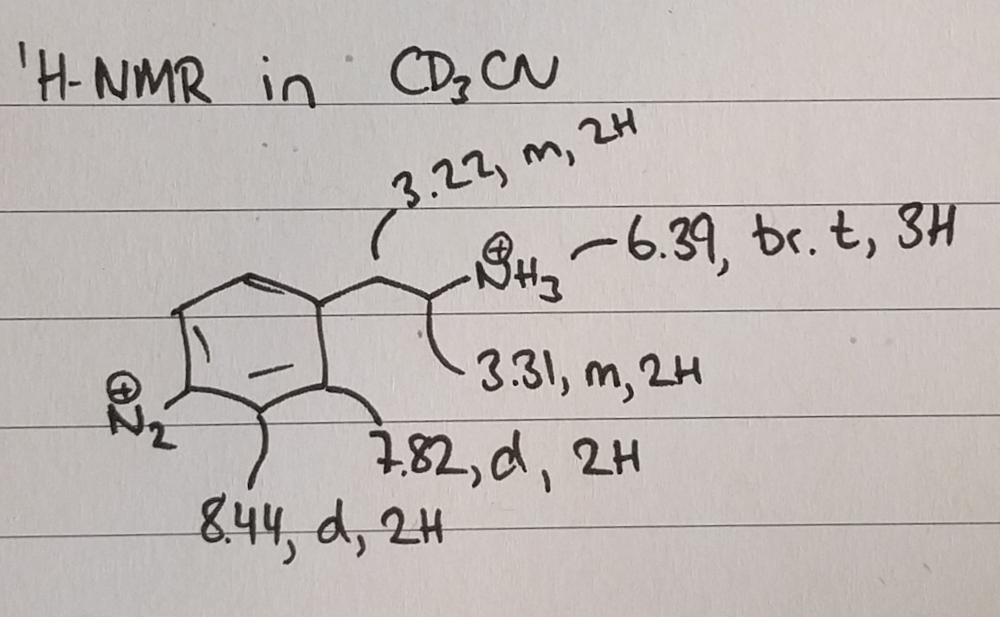

```{r setup, include=FALSE}
knitr::opts_chunk$set(echo = TRUE)
```

```{r child = 'biweekly_header.Rmd'}
```

# Planned experiments from last biweekly report


* Make and discuss a more detailed plan for collaboration with the chemical engineers.
* Produce new graphene for Radisurf and SP Group
* Control experiments with graphene production in 0 mM and 10 mM diazonium salt, to gain more knowledge about the observed Raman peaks. 

# Synthesis of diazonium salt (scale up)

To produce graphene in solutions with higher diazonium concentrations I needed a lot more diazonium compound. Therefore the synthesis was repeated with 2 gram starting material. The solution of the aniline was a lot more prone to make a precipitate, which caused the reaction to run less cleanly. However, ^1^H-NMR and IR confirms the presence of the expected product. I have been unable to confirm the product using ESI-MS. The expected m/z is 74.5471, and it seems that so low masses are not recorded in the spectrum I recieve. 

```{r out.width='99%', echo = FALSE}
knitr::include_graphics("../20171106_Synthesis_of_AEBD_scale-up_files/figure-html/unnamed-chunk-7-1.png")
```

Peaks at 3270, 3206 and 1620 cm^-1^ confirms the amine and 2285 cm^-1^ shows the presence of diazonium groups. The large peak at 1008 cm^-1^ could be from $BF_4^-$ acting as a counter ion for both $-N_2^+$ and $-NH_3^+$. From NMR it is clear that the amine must be protonated as it equals roughly 3H. 

```{r out.width='66%', echo = FALSE}
knitr::include_graphics("../data/raw_data/nmr/20171128_AEBD_2/20171128_AEBD_2.png")
```
```{r out.width='30%', echo = FALSE}

```

I have not been able to identify the broad impurity at 2.4 ppm, but have decided to continue with the compound nonetheless. It was not present in the small scale synthesis I did, but may be it is related to amine starting material that did not dissolve properly in HBF~4~. This explanation is, however, contradicted by the other signals in the H-NMR from the starting material (at 7.4 and 3.0 ppm), for which the integrals seems not to match. 


# Graphene production in new electrochemical cell with active cooling

## Experimental setup 

In the last biweekly report I identified a clear problem with heating of the solvent during electrochemical exfoliation. This caused the diazonium salt to degrade a long time before the exfoliation was complete. For this reason I have the workshop make a stainless steel tube, through which I can flow cold ethanol from Steens old cooling machine through. At the same time, they helped make better connections to the electrodes, so I can now attach 3-4 wires in parallel, making everything work at more appropriate temperatures when drawing 20 A through the system. 

Since the amine has previously been hard to detect, I set up a new exfoliation in 0.1 M H~2~SO~4~, aiming for a 5 mM diazonium concentration. The graphene was exfoliated over 80 minutes at 10 V. Samples were extracted and reacted with naphtalen-2-olate every 20 min to follow the diazonium concentration from the absorption of the azo-dye they form together. 

## Results and Discussion

Under these conditions, every sample extracted reveal a clear spectrum of the azo-dye.

```{r out.width = '100%', echo = FALSE}
knitr::include_graphics("../20171130_GrNH2_production_in_cooled_setup_files/figure-html/uvvis20171130-1.png")
```

Using the previously determined extinction coefficient for the azo-dye, it is possible to find the concentration of the diazonium salt throughout the experiment. Here this is plotted together with data from a previous production where 1 mM diazonium salt was used in a system without active cooling.

```{r out.width = '100%', echo = FALSE}
knitr::include_graphics("../20171130_GrNH2_production_in_cooled_setup_files/figure-html/unnamed-chunk-3-1.png")
```

The cooling system made it possible to keep the temperature below 20 °C at all times. In this modified setup it is clearly possible to keep the diazonium compound present for the entire duration of the exfoliation. Keeping the solution cool might also have a positive influence on the degree of oxidation of the graphene. 

# Conclusion

The graphene has not been isolated yet, so I cannot conclude on the quality of the product in this biweekly. However, the method seems solid and in the new setup it was quite easy to quickly exfoliate 6 grams of graphite. It will be interesting to see what the yield is and what degree of functionalisation is obtained. 

Raman spectroscopy and XPS will follow as soon as possible. 

# Plan for the next two weeks

* Isolate the current batch of graphene and analyse it.
* Given that this production is succesful, I just need to run several more of the same as quickly as possible to deliver to Radisurf, SP Group and the Chemical Engineers. 