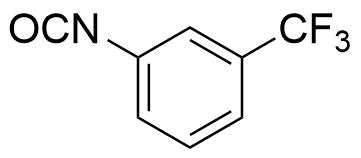

```{r setup, include=FALSE}
knitr::opts_chunk$set(echo = TRUE)
```

```{r child = 'biweekly_header.Rmd'}
```

# Planned experiments from last biweekly report

* Characterisation of the amine-functionalised graphene.
* Meetings with SP Group and Radisurf to discuss which experiments they will make with the graphene. 

# Large scale graphene production

I now have a pretty solid procedure for large scale exfoliation of functionalised graphene. I can exfoliate approx. 5 g/hr, and then it takes another day to do ultrasonication, centrifugation and freeze-drying. 

## Experimental work

I have been repeating the same synthesis procedure a couple of times to make enough graphene for Radisurf and SP Group. Four batches of amine-functionalised graphene (Gr-NH~2~) has been made. There are right now divided in class A and B, where A was made during 1 hour at high diazonium concentration, and B was made using the remaining diazonium salt. The diazonium concentration is estimated based on absorption measurements of the azodye that is formed upon reaction with 2-Naphtol (I would like to remake my calibration curve to be certain that it is accurate).

```{r echo = FALSE, message=FALSE}
library(tidyverse)
data20180119 <- readRDS("../data/derived_data/20180119_export.RData")

data20180119 %>% 
  select(name, conc, m_graphene, m_graphene_out, yield) %>% 
  mutate(conc = round(conc, 1)) %>% 
knitr::kable(col.names = c('Sample name', 'Initial diazonium (mM)', 'Initial graphene mass (g)', 'Resulting graphene mass (g)', 'Yield(%)')) %>% 
  kableExtra::kable_styling(bootstrap_options = "striped")
```

## Results

The results above are very promising, and I now have a working procedure to reliably produce 4 g of functionalised graphene. SP Group already recieved their batch, and I have graphene ready for Radisurf aswell. 

A lot of characterisation still needs to be done, with priority on determining the functionalisation density of amine groups (see next section). The XPS is down at the moment, so this is a little difficult.

The yields in excess of 80 % is probably the most reliable picture - I know that a bit of graphene was lost in exp 1A and I suspect that 1B still contained a bit of water at the time of drying, explaining the unusually high yield. 

# Stability in various solvents

We have spent a lot of time discussing the importance of the protonation state of the amine in Gr-NH2. To function in PUR-synthesis the amine should not be protonated. However, it was not something we were concerned about in Andreas’ project, so it is uncertain how important this is. It is believed that a protonated amine should help stabilise the graphene, due to repulsive charge interactions between layers.

The following pictures demonstrate the state of the graphene (20180119 **2A**) in solution before (left), just after (middle) and two days later (right) after ultrasonication for 1 hour in various solvents (from left to right in each picture): 

* 0.1 M H~2~SO~4~
* Demineralised water
* 0.1 M NaOH
* NMP
* Isopropanol

```{r out.width='33%', echo = FALSE}
knitr::include_graphics(c('../data/raw_data/MVIMG_20180131_144040.jpg', '../data/raw_data/MVIMG_20180131_154739.jpg', '../data/raw_data/MVIMG_20180202_101027.jpg'))
```


## Conclusions
My early conclusions based on these results are, that there is a clear effect upon how easy it is to disperse the graphene, dependent on the pH of the medium. Surprisingly it is easier to disperse the graphene in the basic solvent, indicating that the ionic charge interactions from protonated amine-species are actually binding the graphene sheets more strongly together. This could indicate that a base-wash could be beneficial in my workup procedure (currently I only wash with water to remove acid, and acetonitrile to remove surplus diazonium compound).

The long-term stability is greatly influenced by the presence of ions in the solution, as has previously been determined by Dryfe and co-workers,[@Rodgers2015] and I think this is the main reason that the graphene in basic solution forms a sediment after 48 hours.

# Reactivity testing towards isocyanate coupling

Since the Gr-NH~2~ produced in 20180119 will be used in polyurethane synthesis, it is important to know how many amine-functionalitities are available for reaction. To test this we try to react the graphene with 3-(Trifluoromethyl)phenyl isocyanate. This should allow an easy detection of active amines through the fluorine signal in XPS.

```{r echo = FALSE, out.width='25%'}

```

The method was devised by combining input from several references.[@Oneill2011; @Wang2015a; @SCHMITT2013532] The graphene was dispersed in THF, a quantity of the isocyanate added and this was stirred for 3 hours at room temperature. The graphene was filtered, washed and dried. XPS analysis will be done as soon as possible. 

# Plan for the next two weeks

* Characterisation of the produced graphene, with a focus on functionalisation density
* Production of an unfunctionalised reference
* Setup of new Raman computer

# References
