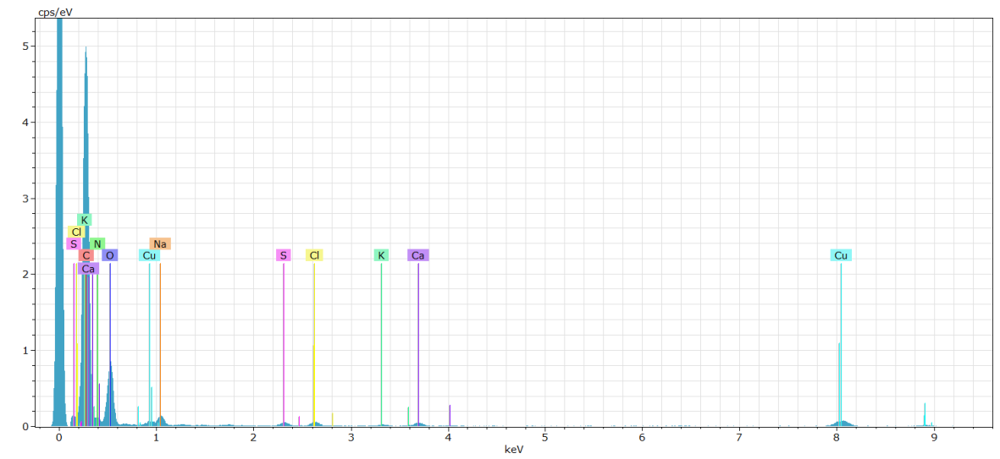
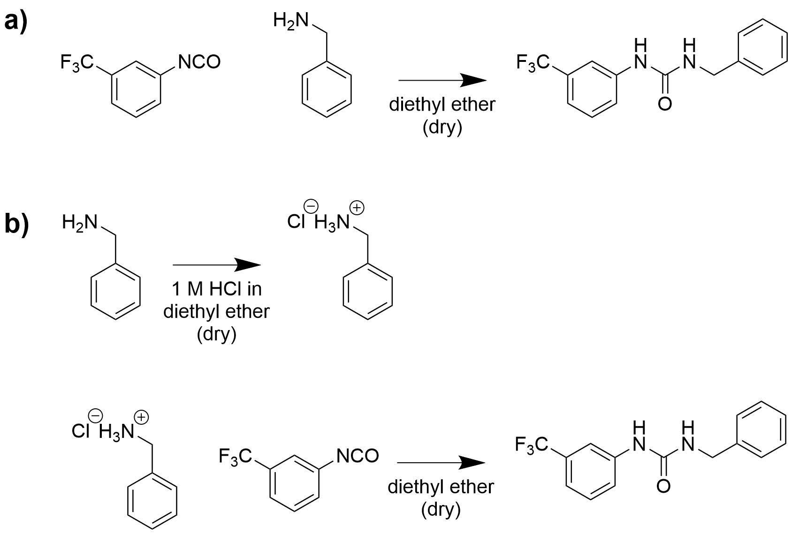

```{r setup, include=FALSE}
knitr::opts_chunk$set(echo = TRUE)
```

```{r child = 'biweekly_header.Rmd'}
```

# Planned experiments from last biweekly report

* Characterisation of the produced graphene, with a focus on functionalisation density
* Production of an unfunctionalised reference graphene
* Setup of new Raman computer

# TEM analysis of GrNH2

Since the XPS has been down, I tried to do some TEM and elemental analysis on the GrNH~2~, in hopes of confirming the amine-functionalities on the graphene. An overall EDX spectrum was obtained which does show a small quantity of nitrogen as well as sulphur, which could be from accompanying sulfate ions (if the functionalities are present as -NH~3~SO~4~ moieties). However, the amount of N is too low to make a good map from these data (it might be possible with longer acquisition times). I also tried to do EELS analysis and was able to opbtain some good spectra, but again the N content seems to be too low to see any signal (which is not unexpected if there is only 1-2 % Nitrogen). I am going to need XPS data to investigate this further, and that should come next week. 

```{r echo = FALSE, out.width='99%'}

```

The TEM was also used to acquire a set of images, and generally I find large (several micrometers) and thin flakes. See the three images below. The flakes appear to fold more smoothly than unfunctionalised flakes, which is to be expected if this is compared to Belangérs work. 

```{r echo = FALSE, out.width='33%'}
knitr::include_graphics(c("../data/derived_data/edx/20180214_GrNH2_0000.png", "../data/derived_data/edx/20180214_GrNH2_0001.png", "../data/derived_data/edx/20180214_GrNH2_0008.png"))
```

# Mixing polyol and water

When visiting SP Group I brought up the possibility of mixing the polyol used in PUR synthesis into the water that is used for graphene exfoliation. This could help stabilise more graphene in solution, without preventing later cross-binding with graphene and isocyanate. Jens Hinke was sceptical because the polyol is hydrophobic, but I decided to run a quick test anyway. 

The pictures below show water with 1 % polyol that was blended for 5 minutes just after mixing (left) and after 48 hours (right). It seems to create an emulsion which is pretty stable. The polyol is clear before mixing, so the which color could indicate emulsion formation. I intend to test this solution (and probably a corresponding solution with 10 % polyol) for graphene exfoliation, to see if this can be used to avoid the exfolation into NMP. That would make our graphene production significantly easier, as about 50 % of the production work goes into removal of NMP after exfolation. 

```{r echo = FALSE, out.width='49%'}
knitr::include_graphics(c("../figs/MVIMG_20180213_142324.jpg", "../figs/MVIMG_20180215_144025.jpg"))
```


# Reactivity testing towards isocyanate coupling

The GrNH~2~ that I have made will be tested in PUR synthesis, and for this it is important that the functional amine groups can couple to the isocyanate groups. To test the influence of the protonation of the amine on this reaction, I wish to conduct the following comparison experiment.

```{r echo = FALSE, out.width='60%'}

```

Based on this, it should be possible to judge whether we need to to a base wash of the GrNH~2~ before mixing into PUR.

After this, the fluorinated isocyanate will be reacted with GrNH~2~ and XPS should be able to tell us to what degree the amines are reacting. 

# Plan for the next two weeks

* Isocyanate comparison experiment
* Production of unfunctionalised reference
* Testing graphene exfoliation in water/polyol mixtures
* XPS analysis of all GrNH2 experiments.
