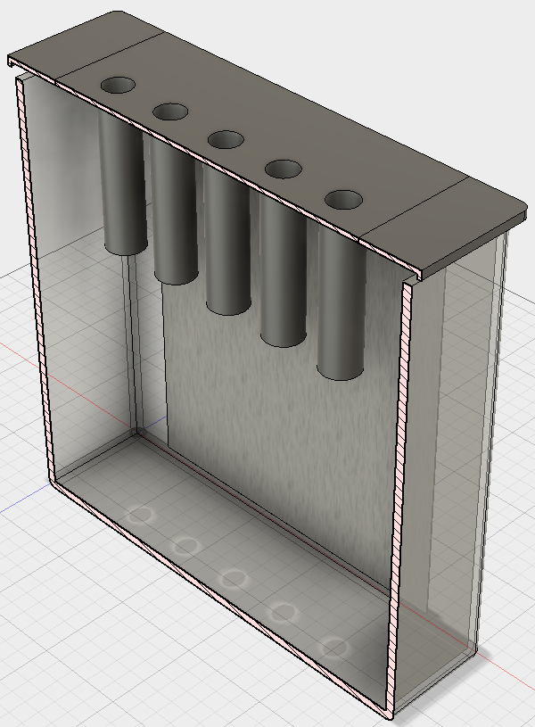

# 20170915 Azo-coupling of diazonium compounds {#j20170915}

In the production of functionalised graphene it would be nice to assess that the diazonium compound is continously present. This was previously attempted using [electrochemistry](#j20170904), but was not succesful due to very low concentrations.

Another possibility is to use the diazonium compound to make an azo-coupling with 2-Naphtol. This should produce a very colorful dye, which should be easy to measure concentration of using UV-Vis absorption spectroscopy. 

## Protocol

```r
library(units)
V = set_units(10, mL) # Volume of 0.1 M H2SO4 to be used
C_diazo = set_units(2, mmol/L)

M_nitro = set_units(202.64, mg/mmol) # 4-Nitrophenethylamine hydrochloride
M_nitrite = set_units(69.00, mg/mmol) # NaNO2
M_naphtol = set_units(144.17, mg/mmol) # 2-Naphtol

n_nitro = V * C_diazo
n_nitrite = n_nitro * 1.5
n_naphtol = n_nitro * 1.5

m_nitro = n_nitro * M_nitro
m_nitrite = n_nitrite * M_nitrite
m_naphtol = n_naphtol * M_naphtol
```

Initially the diazonium compound is formed by mixing 10 mL 0.1 M H~2~SO~4~ with 4.0528 mg 4-Nitrophenethylamine hydrochloride (0.02 mmol) and 2.07 mg NaNO~2~ (0.03 mmol). This is stirred for 15 min. 

The diazonium-solution is then added to a solution of 4.3251 mg 2-Napthol in 2 mL 10 % sodium hydroxide and 5 mL water. This should form a orange-red dye upon heating.

## Journal

## Results and discussion

## Conclusion and outlook


# 20170904 Gr-NH2 production for Radisurf {#j20170904}

Following the [initial tests](#j20170809) in the new graphene production setup a batch of amine-functionalised graphene will be produced. Radisurf will attempt surface-polymerisation on the graphene and embed it in a silicone matrix. 

## Protocol

```r
library(units)
V = set_units(1500, mL) # Volume of 0.1 M H2SO4 to be used
C_diazo = set_units(2, mmol/L)

M_nitro = set_units(202.64, mg/mmol) # 4-Nitrophenethylamine hydrochloride
M_nitrite = set_units(69.00, mg/mmol) # NaNO2

n_nitro = V * C_diazo
n_nitrite = n_nitro * 2

m_nitro = n_nitro * M_nitro
m_nitrite = n_nitrite * M_nitrite
```

The 2 mmol/L 4-(2-aminoethyl)benzenediazonium solution is generated in-situ by mixing 1500 mL 0.1 M H~2~SO~4~ with 607.92 mg 4-Nitrophenethylamine hydrochloride (3 mmol) and 414 mg NaNO~2~ (6 mmol). This is stirred for 15 min. The presence of diazonium-compound is confirmed by dissolving a small amount of ferrocene in DMF and adding some of the solution to check for a green color. 

To test the stability of the diazonium-compound during the electrochemical exfoliation Cyclic Voltammetry will be used periodically under non-grafting conditions (diazonium concentation < 0.1 mM). A blank CV will be recorded in 9.5 mL 0.1 M H~2~SO~4~, 0.5 mL electrolyte solution will be added and a CV recorded for one reductive sweep (range?) using a glassy carbon microelectrode, Pt counter electrode and SCE reference electrode. The temperature should be recorded when extracting samples. 

The electrochemical exfoliation of functionalised graphene will be done by positioning and 8x15 cm^2^ graphite foil between two large stainless steel electrodes and applying 10 V for 1 hour (more if the indication is that the diazonium-salt is still active and the graphite is not fully exfoliated). Weigh the foil before electrolysis

The exfoliated graphene and remaining graphite foil is collected and washed with water and acetonitrile. The graphene is ultrasonicated in DMF and left overnight for graphite to sediment. The upper 95 % of the solution is collected and centrifuged to collect most of the graphene - the remaining part is collected by filtration on 0.45 um nylon membrane filters. All graphene is then ultrasonicated in water and freeze-dried. 

## Journal
The experiment was conducted as described in the protocol. The mass of the graphite electrode was 7.0990 g. The exfoliation was continued for 90 minutes and a ferrocene-test at this point gave a green solution, indicating that diazonium-compound was still present.

The product was dried at 50 °C under vacuum for 2 hours, which was insufficient to completely dry the sample (mass of product at this stage = 279.5 g - 243.9 g = 35.6 g). The mass of the remaining graphite electrode was 1.8904 g, meaning that 5.2086 g graphite was exfoliated in 90 min.


```r
exp170904 <- tibble(
  t = c(0, 15, 30, 45, 60, 90),
  sample_collected = c(TRUE, TRUE, TRUE, TRUE, TRUE, FALSE),
  temp = c(23, 38, 51, 62, 67, 69),
  current = c(17.2, 19.4, 19.7, 19.9, 19.0, 12.7),
  voltage = rep(10, 6))

knitr::kable(exp170904, col.names = c('Time (min)', 'Sample collected', 'Temp. °C', 'Current (A)', 'Voltage (V)'))
```


| Time (min)|Sample collected | Temp. °C| Current (A)| Voltage (V)|
|----------:|:----------------|---------:|-----------:|-----------:|
|          0|TRUE             |        23|        17.2|          10|
|         15|TRUE             |        38|        19.4|          10|
|         30|TRUE             |        51|        19.7|          10|
|         45|TRUE             |        62|        19.9|          10|
|         60|TRUE             |        67|        19.0|          10|
|         90|FALSE            |        69|        12.7|          10|

The exfoliated graphite was then ultrasonicated in 400 mL DMF for 1 hour and left to stand for 2 days (1 was probably enough) to allow residual graphite to sedimentate. The solution was then centrifuged at 4000 rpm for 1 hour and the pellet was collected in water. The remaining graphene solution in DMF was filtered on 0.45 um nylon membrane and the solid product collected in water. The entire graphene solution in water was put in a 500 mL roundbottomed flask and ultrasonicated for 30 min. This was then frozen using liquid nitrogen and put on the freeze-drier.

## Results and discussion

### Following the diazonium-concentration during functionalisation
An attempt was made to monitor the concentration of diazonium compound during the reaction. This is tricky because it must be done at non-grafting concentrations, meaning the diazonium-concentration should be below 0.1 mM (= very low signal). Blank CVs and CVs in diazonium solution at different times during the experiment is displayed below.

```r
path <- "../data/raw_data/electrochemistry/20170904_Gr-NH2_prod_for_Radisurf/"
electrochem170904 <- tibble(filename = list.files(path = path, pattern = "*.txt")) %>%  
  filter(grepl("^((\\d)|(CV2)|(I))", filename)) %>% 
  mutate(sample = stringr::str_extract(filename, "^(\\d){2}"), sample = as.numeric(ifelse(is.na(sample), 0, sample))) %>%
  mutate(sol = stringr::str_extract(filename, "(blank)"), sol = ifelse(is.na(sol), "0.1 mM diazonium", "Blank")) %>% 
  mutate(data = map(paste0(path, filename), read_csv, col_names = c('pot', 'cur'))) %>% 
  unnest()

electrochem170904 %>% 
  ggplot(aes(pot, cur, color = sol)) +
  geom_path() +
  facet_wrap(~sample) +
  labs(x = "Potential (V vs. SCE)", y = "Current (A)") +
  theme(legend.position = "top", legend.title = element_blank())
```


```r
ggsave("../figs/20170904_electrochem_exfoliation.png", width = 16, height = 12, units = "cm", dpi = 300)
```

No clear signal from the diazonium compound is observed in any of the measurements. A crude ferrocene-test gave a green color both before and after the experiment, indicating that the diazonium compound was present.

## Conclusion and outlook


# 20170809 Functionalised graphene by oxidative exfoliation {#j20170809}


```r
library(units)
V = set_units(200, mL) # Volume of 0.1 M H2SO4 to be used
C_diazo = set_units(2, mmol/L)

M_nitro = set_units(202.64, mg/mmol) # 4-Nitrophenethylamine hydrochloride
M_nitrite = set_units(69.00, mg/mmol) # NaNO2

n_nitro = V * C_diazo
n_nitrite = n_nitro * 2

m_nitro = n_nitro * M_nitro
m_nitrite = n_nitrite * M_nitrite
```

## Protocol

This production method is inspired by the work by Belanger and co-workers.[@Ossonon2017]

### In-situ generation of 2 mmol/L 4-(2-aminoethyl)benzenediazonium solution
200 mL 0.1 M H~2~SO~4~ is mixed with 81.056 mg 4-Nitrophenethylamine hydrochloride (0.4 mmol) and 55.2 mg NaNO~2~ (0.8 mmol) and stirred for 15 min.

A small amount of ferrocene is dissolved in 1 mL solution to confirm that the diazonium compound has been formed (green color).

## Exfoliation of functionalised graphene flakes
A 2-electrode setup is made with 100 cm^2^ 0.5 mm graphite foil (cut into four 5x5 cm^2^ pieces) as the anode (+) and a sheet of stainless steel as the cathode (-) in a tall 400 mL beaker. **Consider putting a piece of filter paper between the electrodes to prevent exfoliated graphene contacting the cathode**. The freshly made diazonium-solution is poured into the beaker and the graphite exfoliated at 10 V for 1 hour (longer if the foil is not properly exfoliated at this stage). This was done in our grounded cage, and the ground terminal of the power supply was connected to the cage. 

Wash the remaning graphite foil with water and dry it (for yield calculation). The flakes are then collected with vacuum filtration and washed with water and acetonitrile. Ultrasonicate into DMF to disperse the graphene flakes. Leave overnight to sedimentate remaning graphite. Centrifuge the top part of the DMF solution at high speed for 1 hour to sedimentate the remaning graphene. Remove DMF and ultrasonicate in water. Freeze-dry the aqueous solution to obtain graphene powder. 

## Journal
The experiment was performed as described in the protocol. Graphite foil (for four 5x5 cm pieces, 5.8150 g total mass) was used as the anode. 0.1 M H2SO4 was made by mixing 1.4 mL conc. H~2~SO~4~ and diluting until 250 mL H~2~O. 

The diazonium compound formed as described. Tested against ferrocene in DMF and gave a green solution.

The graphite foil was electrolysed for 3 hr + 20 min. Solution got quite hot, so a lot evaporated = lower water level. Generally the current drawn was approx. 4 A. 

After the electrolysis another ferrocene test was made. A green color indicated that diazonium-compound was still present in the solution despite the high temperatures reached. 

Electrodes were washed and the product filtered, washed with water and acetonitrile. Then ultrasonicated in 250 mL DMF for 30 min and left overnight.

200 mL was decanted the morning after (more could probably have been taking by pipetting off the top layer instead). This was centrifuged at 4000 rpm for 60 min. to collect most of the graphene. The remaining DMF was removed by filtration on 0.45 µm nylon membrane filters. All graphene collected was then dispersed in water by ultrasonication. 

The dry weight of remaining graphite = 4.4859 g

### New setup
Since the previously mentioned production only allowed for a current of 4 A, we did not fully utilize the maximum capacity of our new power supply (max. 20 A). A new electrochemical cell was constructed as illustrated below. Two large stainless steel plates were placed on either side and used as the cathode, while a graphite foil anode was placed in the middle. 




Production in this setup was conducted without the diazonium salt, to confirm that everything worked as expected. 1.5 L 0.1 M H~2~SO~4~ was made (8.25 mL H~2~SO~4~ diluted to 1.5 L). A 8x15 cm^2^ graphite foil (7.0604 g) was used as the anode. This was electrolysed at 10 V for 1 hour (~18-20 A currrent). The exfoliated product was filtrated and washed with water and ethanol. It was then dried in an oven.

After electrolysis 2.7092 g graphite remained (4.3512 g exfoliated in 1 hour). Mass of graphene exfoliated = 292.6 g - 259.6 g = 33 g. However, there is no way that all of this mass is graphene! Lets try to dry it more. (Update on 20170904: Mass recorded to 261.3 g after 2 h at 50 dC in vacuum oven = 1.7 g graphene.)


# References
