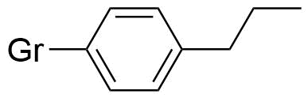
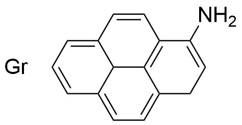

# Electrochemical exfoliation of functionalised graphene for PUR composites

To follow up on the interesting results of [Andreas' Laursens bachelor project](https://osf.io/zh8b2/), inspired by the work of [Ossonon and Bélanger](https://doi.org/10.1016/j.carbon.2016.09.063), functionalised graphene will be produced by electrochemical exfoliation on sulphuric acid, containing diazonium compounds. The graphene powder will then me mixed with a polyol and used in the fabrication of polyurethane (PUR) composites. The mechanical properties of these composites will then be tested for improved properties.

The hypothesis is than the graphene functionalised with amine-groups (Gr-NH2) can be particularly efficient in PUR because the amine can crosslink with the polymer matrix. To study this, a series of control experiments will be conducted to assess the importance of this functional group.

Name | Functional group | Motivation | Amount
--- | :---: | --- | ---
Gr | No specific | Unfunctionalised, oxidatively exfoliated graphene as a baseline experiment. |
Gr-NH2 |  | Graphene with covalently bonded amine-groups should be able to effectively crosslink to the PUR matrix to create a strong interaction. |
Gr-Pr |  | Graphene with an attached group of the same size as the Gr-NH2, but without the chemical functionality. Control experiment to ensure that the chemical crosslinking is necessary for improved strength. |
Gr-pNH2 |  | Graphene non-covalently functionalised with amine-groups (π-π interactions). Control experiment to test the importance of the covalent interaction for the final strength of the material. |

## Tasks

Task | Description | Responsible | Status
--- | --- | --- | ---
**Production of graphene** | Production and purification of four types of graphene samples | Emil | In progress
**Characterisation of graphene** | | |
*Raman spectroscopy* | | Emil |
*XPS* | | Emil, Kristian/Monica |
*STEM-EELS* | | Emil |
*AFM* | | Emil |
 | | |
**Molding of PUR composites** | | Martin/Chemical Engineers |
**Characterisation of composites** | | |
*Tensile testing* | | Martin/Chemical Engineers |
*SEM* | | Emil |
*Other techniques?* | | ??? |
