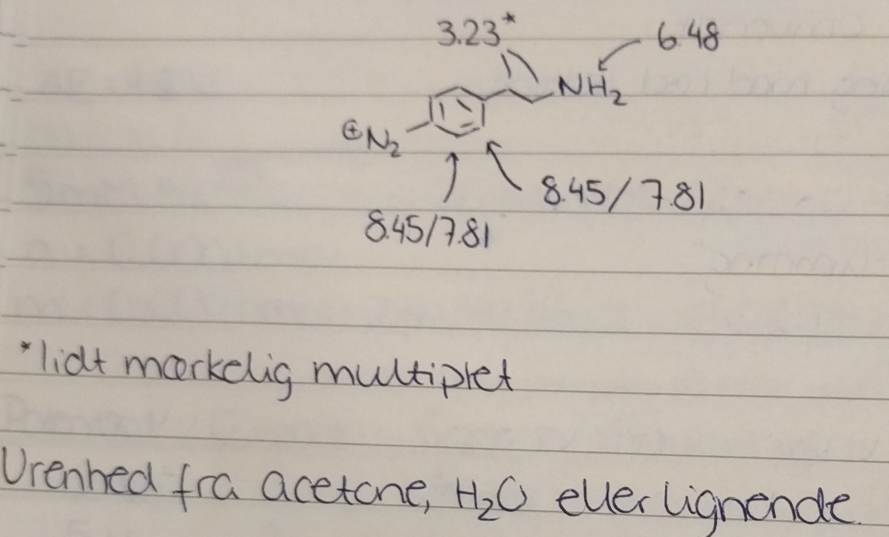
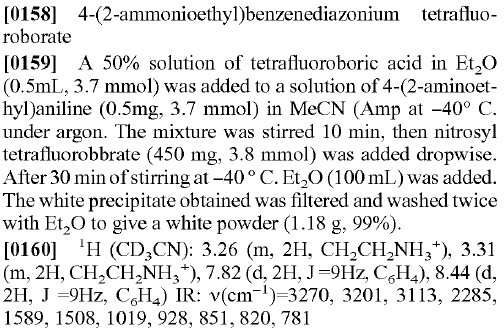

### Line Koefoed labbook (translated from Danish)

Uses same procedure as for 4-(2-hydroxyethyl)benzenediazonium 
V = 1.5 ML (0.48 mL *tert*-butylnitrite + 0.52 mL HBF~4~) + 0.47 mL diamine 
m(4-(2-Aminoethyl)aniline) = $136.19\, g/mol \cdot 3.6\cdot 10^{-3}\, mol = 0.4903\, g$ 
V(4-(2-Aminoethyl)aniline) = $0.4903\, g / 1.034\, g/mL = 0.474 mL$ 

0.474 mL 4-(2-Aminoethyl)aniline is mixed with 0.52 mL HBF4 -> Reacts immediately (smokes) and becomes stiff/hard. Is put on ice-bath. 
A total of 3 mL HBF4 is added, but there is still lumps. 3 mL ACN is added (patent has done the reaction in ACN). 
A lot (ca. 10 mL) ACN is added in total. Goes from bright yellow to bright orange. 
0.48 mL *tert*-butylnitrite is added rather fast -> Turns milky yellow.  
Stopping reaction after 2 hours by pouring into freezer-cold Et~2~O and suction-filtration + rinsing with cold Et~2~O.  
Check with Ferrocene -> Turns green 
The product is a lightly yellow powder.  

NMR: 

### US patent: US 2011/0294044 A1

The synthesis is described in a patent, however the amounts used are a little off (or perhaps they just mean 0.5 g instead of 0.5 mg)

### Paper: Biosensors and Bioelectronics 2011, 26 (5), 2506-2512. [Link](http://www.sciencedirect.com/science/article/pii/S0956566310007578)

Synthesis of 4-aminoethylbenzenediazonium salt (AEBD)

4 ml of HBF4 were added to 6 ml of water and the mixture was allowed to cool to a temperature in the range 0 to 5 $^{\circ}$C. Then 4 milimoles of 4-(2-aminoethyl)aniline were dissolved in the HBF4 solution and allowed to cool (0 to 5 $^{\circ}$C) during 15 minutes. Then, sodium nitrite (0.4 g dissolved in 3 ml of water) was added drop by drop to the acidic amine solution under agitation. The mixture was allowed to react for 40 minutes; during that time the temperature was hold at circa 2 $^{\circ}$C. A precipitate that appeared in the solution was filtered under reduced pressure and rinsed with glacial ether. The salt was then dried under vacuum and kept at -20 $^{\circ}$C. The product was characterized using 1H NMR in deuterated water.

The diazonium salt was characterized by NMR. Spectra were recorded by Brucker AM 300 MHz instrument. The experiments were recorded using D2O as solvent for 1H analysis and D2O with 50 lL aceton (internal reference) for 13C inversegate analysis. The structure of the salt is presented on scheme 1 as well as indexation of protons and carbons.

1H NMR (300 MHz, D2O): d (ppm) 3.20-3.25 (t, 3J = 7.4 Hz, 2H, H-a); 3.30-3.35 (t, 3J = 7.4 Hz, 2H, H-b); 7.80-7.83 (d, 3J = 8.8 Hz, 2H, H-d); 8.44-8.48 (d, 3J = 9.1 Hz, 2H, H-e). 
13C NMR (75 MHz, D2O with aceton): d (ppm): 33.76 (C-a); 39.40 (C-b); 112.69 (C-c); 132.49 (C-d); 132.89 (C-e); 153.24 (C-f).