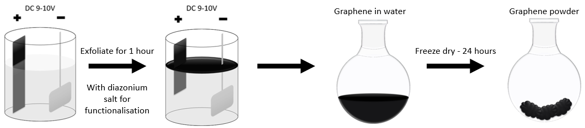

```{r setup, include=FALSE}
knitr::opts_chunk$set(echo = FALSE)
```

## Method

### Oxidative exfoliation of graphene


### *In-situ* synthesis of diazonium-compound


## Method


## Progress
The new setup can produce $\sim 3$ g/h.

Nitrogen is incorporated in the flakes (XPS).

We would like to monitor the $C_{diazo}$ during exfoliation (UV-Vis)


Ready to produce several grams for testing (Radisurf, Newtec, SP Group, Chemical Engineers (AU))

Interested in other functional groups