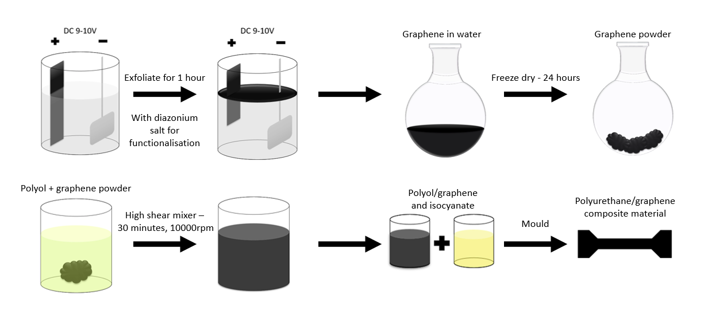
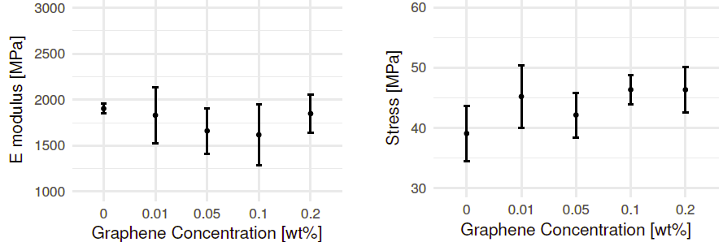
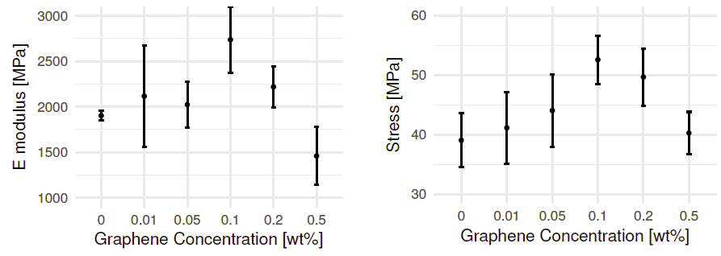
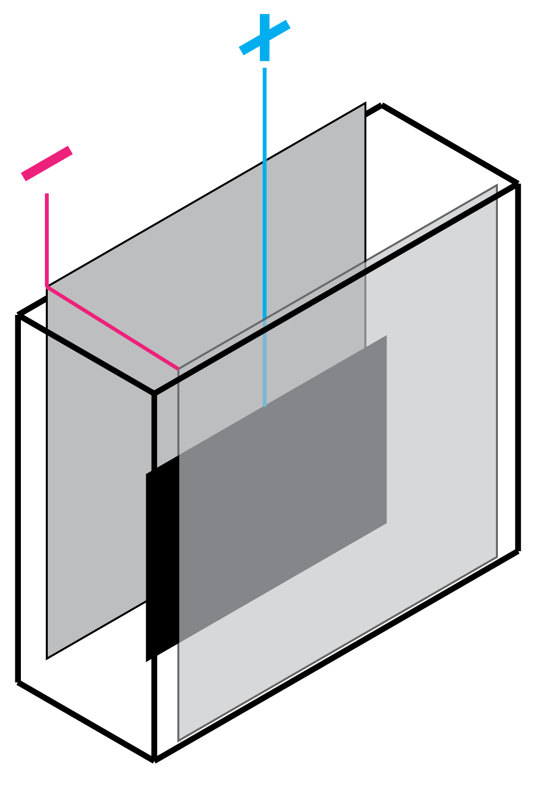
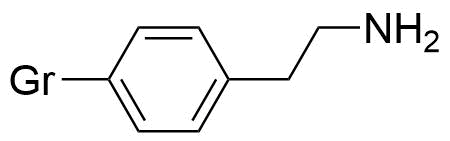
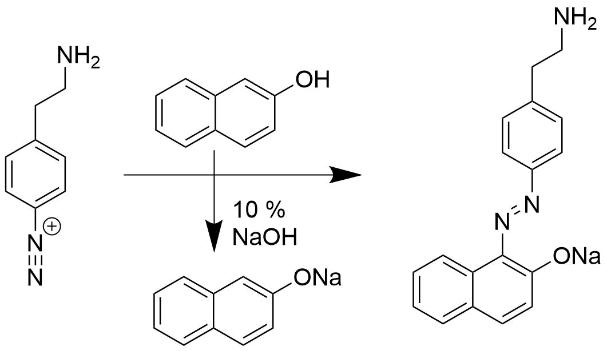
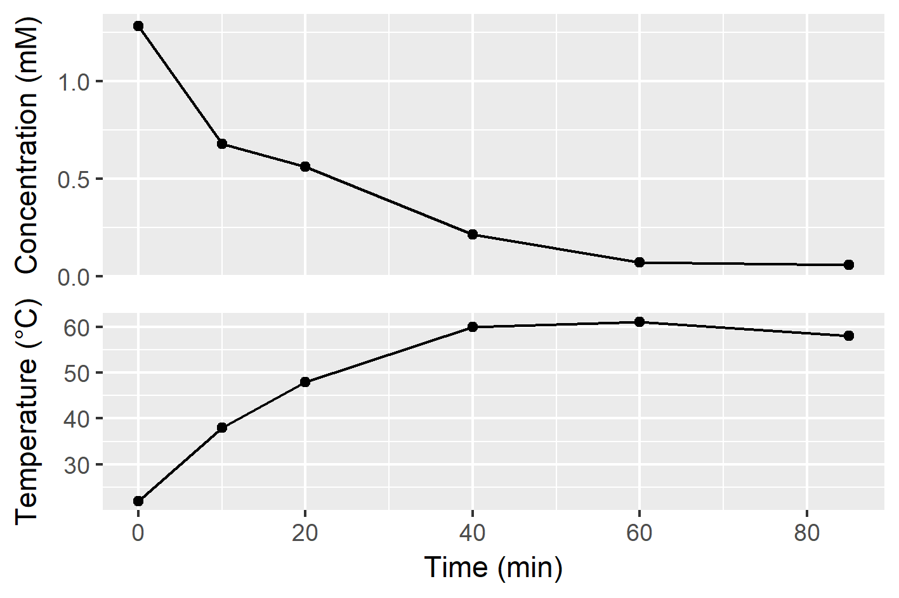
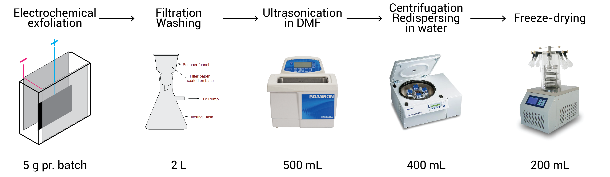

```{r setup, include=FALSE}
knitr::opts_chunk$set(echo = FALSE)
```

## Outline

* Overview of this project
* Method for producing functionalised graphene
* Results
* Current challenges

* Thoughts on open Lab Journals

## Oxidative exfoliation of graphene
```{r out.width = '99%'}

```


## Oxidative exfoliation of graphene
```{r out.width = '70%'}
knitr::include_graphics("../figs/Andreas_TEM.png")
```


## Oxidative exfoliation of graphene
Graphene (unfunctionalised)
```{r out.width = '70%'}

```

Graphene (amine functionalised)
```{r out.width = '70%'}

```

## Current method

<div class="columns-2">
Same chemistry, larger setup: Exfoliation of graphite anode in 0.1 M H~2~SO~4~ at 10 V.

```{r out.width = '70%'}

```


In principle many different functional groups can be introduced.

```{r out.width = '80%'}

```

The new setup can exfoliate $\sim 3$ g/h (10 V at 20 A)

</div>


## Current method

<div class="columns-2">

We would like to monitor the $C_{diazo}$ during exfoliation (UV-Vis)

<br><br>

```{r out.width = '80%'}

```

</div>

```{r message=FALSE, out.width='49%', fig.width=4.5, fig.height=3}
library(tidyverse)
read_delim("../data/raw_data/uvvis/20171027_GrNH2_azodye/171027_GrNH2_00min.csv", skip = 1, delim = ";") %>% 
  ggplot(aes(nm, A)) + 
  geom_line() +
  labs(x = "Wavelength (nm)", y = "Absorption")
```
```{r out.width = '49%'}

```


## Production bottlenecks

```{r out.width= '98%'}

```

The freeze-drying it particularly challenging, because access is not reliable.

Is the open science community able to help with this?

The current interest seems to be 5-15 g for different projects.

## New lab journal